<picture>
  <source media="(prefers-color-scheme: dark)" srcset="https://raw.githubusercontent.com/whos-gabi/whos-gabi/output/github-snake-dark.svg">
  
</picture>

## Whos Gabi?

Fair question.

CS graduate from the University of Bucharest. I build products end to end on my own: backend, frontend, infrastructure, and everything in between.

Most of my repos are private. Client work, NDAs, things that aren't finished. What's pinned below is what I can show.

**Research.** My thesis was Proof of Cognitive Work: pull a knowledge graph out of a document with an LLM, calibrate question difficulty with IRT 3PL, mint the result as a soulbound token. Defended it. Still building on it.

**Crypto.** Solidity, soulbound tokens, and a standing suspicion that half this space is solving problems it invented.

[LinkedIn](https://linkedin.com/in/baghici/) · [WhatsApp](https://wa.me/40730792946)

### Streak

<picture>
  <source media="(prefers-color-scheme: dark)" srcset="https://streak-stats.demolab.com?user=whos-gabi&theme=github_dark&hide_border=true">
  
</picture>

### Stats

